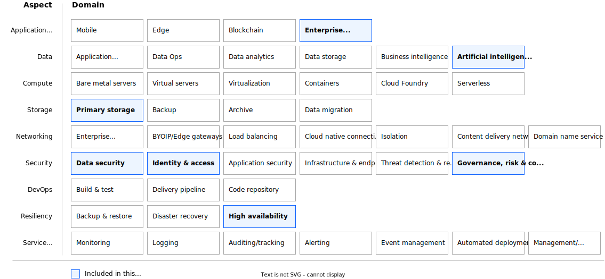

---

# The YAML header is required. For more information about the YAML header, see
# https://test.cloud.ibm.com/docs/writing?topic=writing-reference-architectures

copyright:
  years: 2024
lastupdated: "2024-04-11"

keywords: # Not typically populated

subcollection: deployable-reference-architectures

authors:
  - name: Michele Crudele

# The release that the reference architecture describes
version: 0.2.0

# Use if the reference architecture has deployable code.
# Value is the URL to land the user in the IBM Cloud catalog details page for the deployable architecture.
# See https://test.cloud.ibm.com/docs/get-coding?topic=get-coding-deploy-button
deployment-url: https://cloud.ibm.com/catalog/8bfb1293-8b85-4d3f-a89f-015d0a0719df/architecture/deploy-arch-ibm-watsonx-ai-saas-e8ad6597-8c1a-466a-8bb7-243a109daaa8

docs: https://test.cloud.ibm.com/docs-draft/watsonx-ai-saas-automation

image_source: https://github.com/terraform-ibm-modules/terraform-ibm-watsonx-saas-da/blob/main/reference-architectures/watson-saas-da.svg

related_links:
  - title: 'Overview of Watsonx AI SaaS Automation with Assistant and Governance'
    url: 'https://test.cloud.ibm.com/docs-draft/watsonx-ai-saas-automation?topic=watsonx-ai-saas-automation-overview'
    description: 'Description.'

# use-case from 'code' column in
# https://github.ibm.com/digital/taxonomy/blob/main/topics/topics_flat_list.csv
use-case: AIAndML

# industry from 'code' column in
# https://github.ibm.com/digital/taxonomy/blob/main/industries/industries_flat_list.csv
industry: Banking,FinancialSector,ITConsulting,Technology,Telecommunications

# compliance from 'code' column in
# https://github.ibm.com/digital/taxonomy/blob/main/compliance_entities/compliance_entities_flat_list.csv
compliance:

content-type: reference-architecture

# For reference architectures in https://github.com/terraform-ibm-modules only.
# All reference architectures stored in the /reference-architectures directory

# Set production to true to publish the reference architecture to IBM Cloud docs.

production: false

---

<!--
The following line inserts all the attribute definitions. Don't delete.
-->
{{site.data.keyword.attribute-definition-list}}

<!--
Don't include "reference architecture" in the following title.
Specify a title based on a use case. If the architecture has a module
or tile in the IBM Cloud catalog, match the title to the catalog. See
https://test.cloud.ibm.com/docs/solution-as-code?topic=solution-as-code-naming-guidance.
-->

# Watsonx AI SaaS Automation with Assistant and Governance
{: #title-id}
{: toc-content-type="reference-architecture"}
{: toc-industry="value"}
{: toc-use-case="value"}
{: toc-compliance="value"}
{: toc-version="value"}

<!--
The IDs, such as {: #title-id} are required for publishing this reference architecture in IBM Cloud Docs. Set unique IDs for each heading. Also include
the toc attributes on the H1, repeating the values from the YAML header.
 -->

The Watsonx AI SaaS deployable architecture is designed to automate the deployment and
configuration of the {{site.data.keyword.IBM_notm}} watsonx platform in an {{site.data.keyword.Bluemix_notm}} account. The {{site.data.keyword.IBM_notm}} watsonx platform is made of several services working together to offer AI capabilities to end users who can explore them using [{{site.data.keyword.IBM_notm}} watsonx projects](https://dataplatform.cloud.ibm.com/docs/content/wsj/manage-data/manage-projects.html?context=wx&audience=wdp). The automation also configures a starter project for an existing {{site.data.keyword.Bluemix_notm}} user.

A typical use case would be setting up an IBM watsonx platform ready to use in one or more Enterprise accounts granting administrator access
to an AI Researcher.

The deployable architecture can also be used as part of a larger solution, where it is included in a stack
of other components.
To facilitate those business challenges, it provides output parameters that can be used programmatically
for wiring the deployable architecture to the other components of the stack, and it implements the flexibility
to install additional Watson services.

## Architecture diagram
{: #architecture-diagram}

{: caption="Figure 1. Watsonx AI SaaS Automation with Assistant and Governance deployable architecture" caption-side="bottom"}{: external download="watsonx-saas-da.svg"}

The Watsonx AI SaaS deployable architecture lays down the services shown in the WatsonX services box and an instance of {{site.data.keyword.cos_full_notm}} in a target {{site.data.keyword.Bluemix_notm}} account, resource group, and region. Then, it automatically configures a starter project that grants access to an existing {{site.data.keyword.Bluemix_notm}} user, for example, an AI researcher. As a result, that user can
log into the {{site.data.keyword.IBM_notm}} watsonx starter project, and start working.

You can add or deploy one or more of the services from the optional services section at a later date during the lifetime of the deployable architecture.

## Design concepts
{: #design-concepts}

{: caption="Figure 2. Scope of the design requirements" caption-side="bottom"}

## Requirements
{: #requirements}

The following table outlines the requirements that are addressed in this architecture.

| Aspect | Requirements |
| -------------- | -------------- |
| Enterprise applications | Lay down and grant access to the {{site.data.keyword.IBM_notm}} Watsonx Artificial Intelligence and Governance platform. |
| Storage            | Provide storage that meets the application performance and security requirements |
| Security           | * Protect boundaries against denial of service and application layer attacks. \n * Encrypt all application data in transit and at rest to protect from unauthorized disclosure. \n * Encrypt all security data (operational and audit logs) to protect from unauthorized disclosure. \n * Protect secrets through their entire lifecycle and secure them using access control measures. |
| Resiliency         | * Support application availability targets and business continuity policies. \n * Ensure availability of the services in the event of planned and unplanned outages \n * Provide highly available storage artificial intelligence assets. |
| Service Management | Monitor audit logs to track changes and detect potential security problems. |
{: caption="Table 1. Requirements" caption-side="bottom"}

## Components
{: #components}

The following table outlines the services used in the architecture for each aspect.

| Aspects | Architecture components | How the component is used |
| -------------- | -------------- | -------------- |
| Storage | Cloud Object Storage | Stores artificial intelligence {{site.data.keyword.IBM_notm}} Watsonx data assets managed by Watson Machine Learning and Watson Studio services. |
| Security | IAM | {{site.data.keyword.iamlong}} authenticates and authorizes any user interaction. |
| Resiliency | All {{site.data.keyword.Bluemix_notm}} provisioned services | Fully managed services that provide resiliency and high availability. |
| Application platforms | IBM watsonx platform | End users interact with the {{site.data.keyword.IBM_notm}} watsonx platform to manage artificial intelligence assets and data. |
{: caption="Table 2. Components" caption-side="bottom"}

## Compliance
{: #compliance}

The Watsonx AI SaaS Automation with Assistant and Governance adheres to the IBM Cloud for Financal Services Security & Compliance Center profile.

## Next steps
{: #next-steps}

_Optional section._ Include links to your deployment guide or next steps to get started with the architecture.
